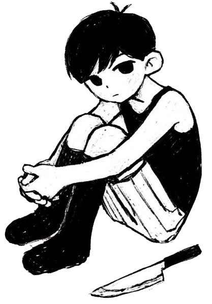

<p align="center">
<picture>
    <source srcset="/assets/title_dark.webp" media="(prefers-color-scheme: dark)">
    <source srcset="/assets/title.webp" media="(prefers-color-scheme: light)">
    
</picture>
<br>

<br>
<a href="https://github.com/m-obeid"></a>
<a href="https://www.youtube.com/@pocoguy?sub_confirmation=1"></a>
<a href="https://discord.gg/7eF7v3MBQH"></a>
<a href="https://www.tiktok.com/@pocoguy.exe"></a><br>
<em>oh and btw, i'm planning to make a personal website again!</em>
</p>

```javascript
const mohamad = {
  age: 16,
  job: "student",
  country: "de",
  schoolType: "Gymnasium",
  schoolGrade: 9,
  personalityType: "INFP",
  pronouns: "he" | "him",
  code: ["JavaScript", "HTML", "CSS", "Python", "C#"],
  tools: [Node, DotNet, VisualStudio, VisualStudioCode, Bootstrap, MongoDB],
  smartphone: "Google Pixel 7 Pro Obsidian 128GB",
  tablet: "Apple iPad Pro (2021) 256GB",
  mainSetup:
  {
    cpu: "AMD Ryzen 5 5600X",
    gpu: "NVIDIA GeForce RTX 3060 12GB",
    ram: "Corsair Vengeance LPX 16GBx2 DDR4-3600",
    os: "Windows 11 Pro",
    monitor: "LG ULTRAWIDE 21:9 28 inches (2560x1080)"
  },
  thinkpad: {
     model: "E580",
     cpu: "Intel Core i5-8250U",
     gpu: undefined,
     ram: "8GB",
     os: "macOS Sonoma (OpenCore)" 
  }
}
```
<p align="center">

<br>
Last updated: July 2024
</p>


