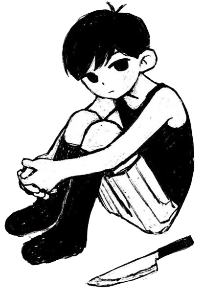

<p align="center">
<picture>
    <source srcset="/assets/title_dark.webp" media="(prefers-color-scheme: dark)">
    <source srcset="/assets/title.webp" media="(prefers-color-scheme: light)">
    
</picture>
<br>

<br>
<a href="https://github.com/m-obeid"></a>
<a href="https://www.youtube.com/@pocoguy?sub_confirmation=1"></a>
<a href="https://discord.gg/7eF7v3MBQH"></a>
<a href="https://www.tiktok.com/@pocoguy.exe"></a><br>
<em><strike>oh and btw, i'm planning to make a personal website again!</strike> done, check <a href="https://pocoguy.com/">POCOGuy.com</a></em>
</p>

```javascript
const mohamad = {
  age: 18,
  job: "student",
  country: "de",
  schoolType: "42 Wolfsburg",
  schoolGrade: "Future Pisciner",
  personalityType: "INFP",
  pronouns: "he" | "him",
  code: ["JavaScript", "HTML", "CSS", "Python", "C#"],
  tools: [Node, DotNet, VisualStudio, VisualStudioCode, Bootstrap, MongoDB],
  smartphone: "Google Pixel 7 Pro Obsidian 128GB",
  tablet: "Apple iPad Pro (2021) 256GB",
  mainSetup:
  {
    model: "Dell Precision 7670",
    cpu: "Intel(R) Core(TM) i7-12850HX",
    gpu: "NVIDIA QUADRO RTX A2000 Mobile (8GB)",
    ram: "32GB DDR5-4800 CAMM",
    os: "Arch Linux",
    de: "GNOME 49.2",
    monitors: ["LG ULTRAWIDE 21:9 28' IPS (2560x1080@75Hz)", "Generic Lenovo 16:10 24' IPS (1920x1200@60Hz)", "Built In Screen (1920x1200@60Hz)"],
    hostname: "whitespace"
  }
}
```
<p align="center">

<br>
Last updated: Dec 2025
</p>


