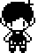

<h1> WELCOME TO CODESPACE</h1>

<p><em>I'm Mohamad Obeid, but most people on the internet know me as POCOGuy or omoriboy. I fricking love computers and OMORI :D</em></p>

[](https://github.com/m-obeid)

### A little more about me...

```javascript
const mohamad = {
  age: 16,
  job: "student",
  country: "de",
  schoolType: "Gymnasium",
  schoolGrade: 8,
  personalityType: "INFP",
  pronouns: "he" | "him",
  code: ["JavaScript", "HTML", "CSS", "Python", "C#"],
  tools: [Node, DotNet, VisualStudio, VisualStudioCode, Bootstrap, MongoDB],
  smartphone: "Google Pixel 7 Pro Obsidian 128GB",
  tablet: "Apple iPad Pro (2021) 256GB",
  mainSetup:
  {
    cpu: "AMD Ryzen 5 5600X",
    gpu: "NVIDIA RTX 3060 12GB",
    ram: "Corsair Vengeance LPX 16GBx2 DDR4-3600",
    os: "Windows 11 Pro",
    monitor: "LG ULTRAWIDE 21:9 28" (2560x1080)"
  },
  thinkpad: {
     model: "E580",
     cpu: "Intel Core i5-8250U",
     gpu: undefined,
     ram: "8GB",
     os: "macOS Sonoma (OpenCore)" 
  }
}
```

I do all kinds of projects on this GitHub. Check it out. Besides playing around with hardware and software, I like playing video games, listening to music, hanging out with my few friends and making digital art. 

This README is still in construction, I'm probably going to change it quite a bit.

---
